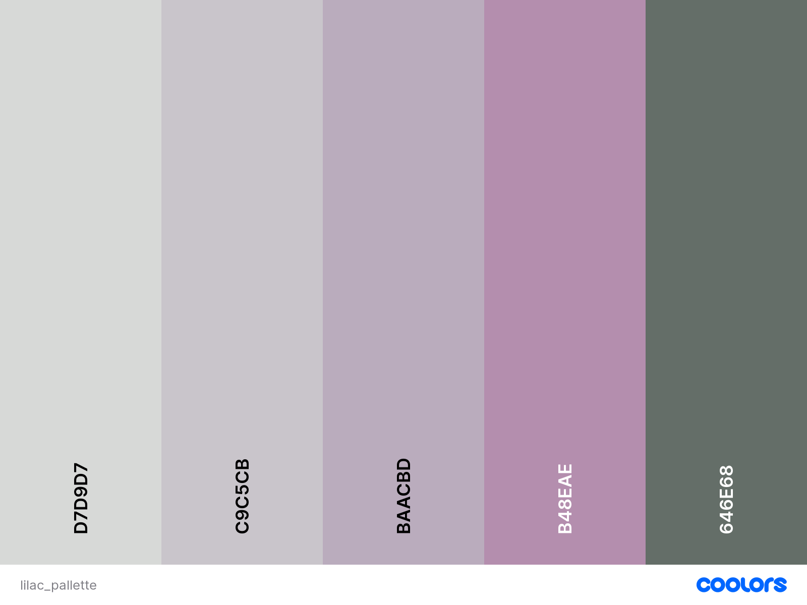
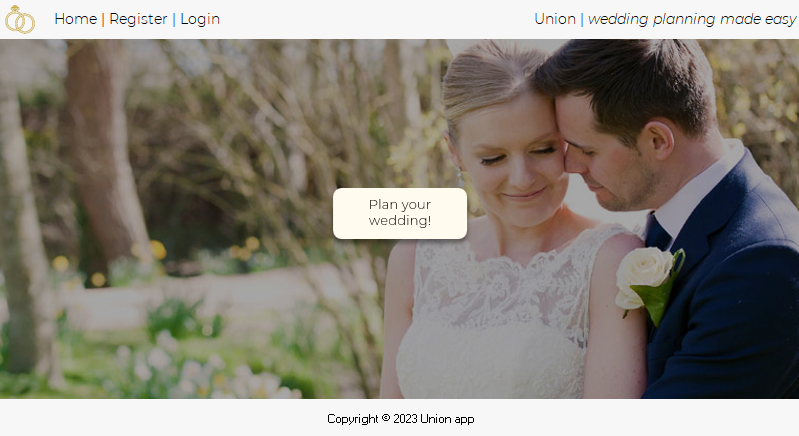

# Union Wedding App Website

[View the live project here](https://rm-weddingapp.herokuapp.com/)

The Union Wedding App website is designed to be responsive, allowing visitors to view it on a range of devices.

## CONTENTS

* [User Experience (UX)](#User-Experience-(UX))

* [Design](#Design)

* [Technologies Used](#Technologies-Used)

* [Setup & Deployment](#Setup-&-Deployment)

* [Testing](#Testing)
  
* [Credits](#Credits)

- - -

## User Experience (UX)

### Initial Discussion

Union Wedding App is an online wedding planning application that enables site users to create and manage guest lists and record their attendees’ preferences.  Future developments would include the ability to design and send wedding invitations to guests via email, as well as receive and update results from guests’ RSVPs.

#### Key information for the site

* When is the site user's wedding event
* Who are the potential wedding guests
* What are the wedding guests' details and preferences
* How can the site users get in touch via social media

### User Stories

#### First-Time Visitor Goals

* USER STORY: Understand the website - As a **First Time Visitor** I can **understand what the site offers** so that **I can decide whether to register**
* USER STORY: Social Links - As a **First Time Visitor** I can **view social media account links** so that **I can get a better appreciation for the company and get in contact**
* USER STORY: Register Account - As a **First Time Visitor** I can **easily register my account** so that **I can access site functionality**

#### Returning User Goals

* USER STORY: Easy Navigation - As a **Site User** I can **easily navigate the site** so that **I don't get stuck**
* USER STORY: View user-specific content - As a **Site User** I can **view my user-specific guest list** so that **I don't accidentally contact people I don't know**
* USER STORY: Create Wedding Event - As a **Site User** I can **create an event** so that **I can access site functionality**
* USER STORY: Edit Wedding Event - As a **Site User** I can **edit an event** so that **I can correct mistakes or accommdate changes**
* USER STORY: Add Guests - As a **Site User** I can **add guests** so that **I can build a list of potential attendees**
* USER STORY: Edit Guests - As a **Site User** I can **edit guests** so that **I can make alterations to a list of potential attendees**
* USER STORY: Delete Guests - As a **Site User** I can **delete guests** so that **I can correct mistakes in a list of potential attendees**

#### Incomplete/Future User Goals

* USER STORY: Create invite - As a **Site User** I can **create an invite** so that **I can tailor messages to suit my tastes** 
* USER STORY: RSVP - As a **Guest Recipient User** I can **RSVP** so that **I can accept or decline an invitation and advise as to my preferences**
* USER STORY: View List of Attendees - As a **Site User** I can **view/filter list of attendees** so that **I can make informed  decisions based on criteria**

## Design

### Colour Scheme

The colour scheme for the website was created via [Coolors](https://coolors.co/), utilizing a pastoral wedding scene photo as the basis for generating the palette. To ensure adequate contrast for various site elements, tonal variations were carefully selected.

### Typography

Two Google Fonts Were used throughout the website:

* Playfair Display is used for headings on the site. It is a serif font that is often seen in high-end, luxury branding and editorial design due to its elegant and sophisticated appearance.

* Figtree is used for the body text on the site. It is a sans-serif font that is characterised by its clean lines and minimalist design that improves readability.  

### Imagery

All images were used with the permission of their owners, all of which have been credited in the [credits](#Credits) section.

### Mockups & Schema

A desktop view mockup for the homepage was created in Excel.

An initial schema for the class-based models was also drafted in Excel:

[Class-based model schema draft](/static/images/class_model_schema_plan.png)

### Features

The website currently comprises three main pages: the landing page before login, the homepage visible to the authenticated user, and the guest list page. Available pages change according to user actions as explained below.

* All website pages extend the base.html that includes:

  * A header positioned at the top of the page, featuring the website name, Union, along with a responsive nav bar and a tagline offering the user "a helping hand for your big day". The nav bar is located in a familiar place and collapses to a hamburger icon on smaller devices to enhance the user experience and not crowd the screen. The nav bar initially displays three links for the unauthenticated user: Home, Sign Up, and Log In. When authenticated this changes to Home and Logout(username), and when the user has created a wedding Event the Guest list link also appears.

    + [Header and unauthenticated user navbar](/static/images/nav_bar_active_page_highlighted.png)
    + [Navbar variation: authenticated user that hasn't created an event](/static/images/new_user_no_event_navbar.png)
    + [Navbar variation: authenticated user that has created an event](/static/images/authenticated_user_with_event_navbar.png)

  * A footer containing links to fictitious social media accounts; Instagram, Facebook and Twitter. Icons were chosen to maintain a familiar and uncluttered appearance.

    [Footer section with social links](/static/images/footer_with_social_links.png)

* Home Page

  
  * A bold and clear tagline states to the user that the site offers "Wedding planning made easy".
  * A succinct description of the site's core functionality is detailed below; "Create guest lists, send RSVP invitations and view attendees via simple dashboards".
  * An evocative hero image of a married couple appearing serene in a picturesque landscape is included to stir the emotions of the would-be site user.
  * Large buttons sit beneath the site description encouraging the user to Sign Up or Log In.

* Home Page (authenticated)

  The first-time authenticated user is presented with two sections:
  * Empty Event Card - This section encourages the user to create their event, which will unlock the guest list area:
  
  * Empty event statistics card (Attendees) - This section details that the number of event guests created is currently 0, and advises that the user must "...create an event before adding guests".
  
  
  Having created an event, the authenticated user is presented with the following sections:

  * Populated Event card - This section now displays details of the user's event: event name, event date, and event time. A future iteration could allow the user to upload their image.
  
  * Populated event statistics card (Attendees) - This section now details the number of guests the user has created for their event along with a button prompting the user to Add Guests that links to the Guest list page. Future iterations of this section could allow the user to apply filters to the guests e.g. attending, vegetarian, teetotal etc.
  

* Guest list
  The guest list only becomes visible following the creation of an event. The first-time authenticated user is presented with a single section:
  * Add guest - A simple form that enables the user to "Add Guest" by entering their guest's name. To simplify the process, I opted to populate a single name field initially and add the remaining guest details at a later stage.
  
  Form validation via Crispy Forms ensures that each guest is unique to the user (not all site users), and prompts when duplicate guest names are entered (see [Full Testing](#full-testing) for details).
  * Guest list - Once the first guest is added, a guest list will appear next to the form.  Each list entry indicates that it is selectable by changing colour on hover, and also details that the user can "click to edit".
  
  When a guest list item is clicked, the user is taken to the Edit Guest page which allows the guest to either be edited or deleted, thus allowing full CRUD functionality. 
* Future Implementations.
  * Allow users to create wedding invitations containing uploaded pictures and messages of their choosing.
  * Connect a mail account so that guests can be sent invites via email.
  * Enhance the Attendees card on the homepage to display various statistics such as total guests invited, total guests attending, as well as tallies of various dietary requirements e.g. 10 x vegetarians, 5 x teetotal.

### Accessibility

Throughout the coding process, I have made a conscious effort to prioritize website accessibility. This has been accomplished through several measures, including implementing semantic HTML, adding descriptive alt attributes to images, providing information for screen readers in instances where icons are used instead of text (such as footer icons), maintaining sufficient colour contrast across the site, and making sure that menus are easily navigable for users with screen readers by indicating the current page.

- - -

## Technologies Used

### Languages Used

HTML, CSS and Python were used to create this website.

### Frameworks, Libraries & Programs Used

Django==3.2.18 - Framework used to simplify Python programming

    Django-allauth==0.52.0 - used for site authentication

    Django-crispy-forms==1.14.0 - used for form validation

    python-slugify==8.0.1 - used for creating slugfield values

elephantSQL - To house the postgreSQL database

Heroku - For deployment

Cloudinary - As a cloud image repository

Git - For version control.

[Github](https://github.com/users/Rob-Mundy/projects/3/views/1) - To create issues from user stories and manage via Kanban board.

Bootstrap - Framework code used throughout the website including Nav bar, Hero image, and Guest list list group. Amendments to Bootstrap classes and custom stylings were added via a separate style.css file saved in the static folder.

Google Fonts - To select and import the fonts used throughout the website.

Font Awesome - To select and import the iconography for the Social footer links.

Google Dev Tools - For testing, troubleshooting, and improving accessibility and responsiveness.

- - -

## Setup-&-Deployment

### Setup Django and supporting libraries

This project was created using the Django framework, which was installed as follows:

+ In the Terminal:

    + Install Django and gunicorn: pip3 install 'django<4' gunicorn

    + Install supporting libraries: pip3 install dj_database_url psycopg2

    + Install Cloudinary Libraries: pip3 install dj3-Cloudinary-storage

    + Create requirements file: pip3 freeze --local > requirements.txt

    + Create Project: django-admin startproject union . 

    + Create App: python3 manage.py startapp weddingapp

+ In settings.py:

    + Add to installed apps: INSTALLED_APPS = [
    …
    'weddingapp']

    + save file

+ In the Terminal:

    + Migrate Changes: python3 manage.py migrate

    + Run Server to Test: python3 manage.py runserver

### Setup external database

elephantSQL.com was used to create the postgreSQL database via the following process:

+ Log in to elephantSQL account

+ Click “Create New Instance”

+ Name the plan and select the Tiny Turtle (Free) plan

+ Click “Select Region” and select a nearby datacenter

+ Click “Review”, check the details are correct, and click “Create instance” 

+ Click on the database instance name for this project on the dashboard and make a note of the  ElephantSQL database URL to add to env.py and Heroku

Return to Gitpod to attach the database as follows:

+ Create env.py file on top-level directory and while inside:

    + Import os library: import os

    + Set environment variables: os.environ["DATABASE_URL"] = "Paste in ElephantSQL database URL"

    + Add a secret key that has been generated via [Djecrety](https://djecrety.ir/): os.environ["SECRET_KEY"] = "Paste in Djecrety secret key"

### Deployment

This project was deployed to Heroku via the following process:

+ From the homepage click "New" then "Create new app"

+ Give the project an appropriate name, rm-weddingapp in this case, select "Europe" as the region then click "Create app"

+ In the "Settings" tab, click Reveal Config Vars

+ Add the following Config Vars:
    + DATABASE_URL = Paste in ElephantSQL database url. 

    + SECRET_KEY = Paste in Djecrety secret key. 

    + CLOUDINARY_URL = Paste in Cloudinary URL 

    + DISABLE_COLLECTSTATIC = 1 (temporary step, disable before deployment)

+ In the "Deployment" tab, select "GitHub - Connect to GitHub" as the Deployment method

+ Search for the GitHub project name, "Rob-Mundy/p4-weddingapp", in the "Search for a repository to connect to" search box

+ Click the "Connect" button at the bottom of the page

+ When connected, scroll to the bottom of the page and in the "Manual deploy" section, select "main" as the chosen branch to deploy and click "Deploy Branch"

+ Following a short build process, a link to the project becomes available

+ Click "View" to [open the project in a new window](https://rm-weddingapp.herokuapp.com/)

- - -

## Testing

The following considerations were highlighted during a tutoring session:

* Given the time constraints, the initial project scope would be overly ambitious. Therefore, it will be crucial to employ an Agile approach to prioritize feature implementation in a logical sequence.

### Validation

+ All HTML pages passed through the official W3C Validator without errors.

+ All CSS pages passed through the official W3C Jigsaw Validator without errors.

+ All Python files successfully passed through the CI Python Linter; all clear, no errors. 

### Solved Bugs

1. I twice attempted to implement AJAX to update the guest list page without requiring a page refresh.  The first occasion was with HTMX, which required a change to my model.  Unfortunately, the changes created issues with the database which meant that it had to be dropped. To do this, the following process was observed: 
    + Remove Django migrations:
      Remove all migrations files within the project. Go through each of the project apps' migration folders and remove everything inside except the __init__.py file.
    + Drop the database:
      Navigate to the Elephant SQL dashboard, select the correct database, and click the reset button.
    + Re-configure project:
      In the GitPod Terminal, run the commands "python3 manage.py makemigrations" and "python3 manage.py migrate" to remake migrations and set up the new database.
      Create a new superuser by running: "python manage.py createsuperuser".

2. I faced a challenge in preventing the entry of duplicate guests due to the slug field that's added within the post method of the Guest object. Since the guest_name field is not unique, it was important to differentiate between multiple individuals with the same name to access the edit_guest page via the slug field. I ultimately decided to allow only a single instance of each guest name per user, with variations created as necessary. However, implementing guest_name validation before the slugfield validation proved difficult. To address this issue, I pre-populated the user on the AddGuestForm as a hidden field and incorporated the following constraints to the Guest model, which were then validated by Crispy Forms.:
constraints = [models.UniqueConstraint(fields=['user', 'guest_name'],  name='unique guest for each user')]

### Known Bugs

1. Although no visible links to the guest list exist before an event is created, users can manually add '/guest_list/' to the website's URL, resulting in a 404 page not found error. To improve user experience, I plan to include a message that redirects users to the home or create event page instead of reaching a dead end. 

### Testing User Stories

First Time Visitors
  + USER STORY: Understand the website - As a **First Time Visitor** I can **understand what the site offers** so that **I can decide whether to register**
      + The [landing page](/static/images/home_page_hero_and_signup_login.png) for the first-time user clearly states the potential benefit to the user that your "Wedding plans..." will be "...made easy" as well as describes the features that the fully-fledged site will offer. See [Features](#features) for details.
  + USER STORY: Social Links - As a **First Time Visitor** I can **view social media account links** so that **I can get a better appreciation for the company and get in contact**
      + A [Footer section with social links](/static/images/footer_with_social_links.png) can be found at the bottom of every page in a familiar and consistent position.  Users will recognise the social media icons and understand they are clickable due to the change in colour when hovered over by the cursor.
  + USER STORY: Register Account - As a **First Time Visitor** I can **easily register my account** so that **I can access site functionality**
      + First-time users will encounter large and prominent buttons on the home page asking them to "Sign Up".  They are positioned directly below the website's statement of intent so that a user can make a decision and sign up without having to move around the screen.  
      + Users are also able to sign up via a link in the navigation bar that disappears after authentication.

Returning Users
  + USER STORY: Easy Navigation - As a **Site User** I can **easily navigate the site** so that **I don't get stuck**
      + The navigation header (navbar) is situated at the top of each page, consistent with most websites.
      + Active pages are indicated by **bold** navigation links.
      + To improve the user experience, the navbar is responsive and collapses to a hamburger icon on smaller screens.
      + The navbar headings vary depending on the user's journey through the site. See [Features](#features) for details.  
  + USER STORY: View user-specific content - As a **Site User** I can **view my user-specific guest list** so that **I don't accidentally contact people I don't know**
      + Filters are applied to the class-based views so that only objects relating to the authenticated user are displayed. 
      + 404 errors are returned if the user attempts to access an event or guest id that relates to another user.
  + USER STORY: Create Wedding Event - As a **Site User** I can **create an event** so that **I can access site functionality**
    + The first-time authenticated user can navigate to the event creation page via the "Create Event" button on the homepage.  The user is then presented with a simple form requesting that they enter the Event name, Event date and Event time.
    
    + Form validation via Crispy Forms ensures all fields are populated and adhere to the Event model's specifications (see [Full Testing](#full-testing) for details).
    + A modal will appear at the top of the screen displaying a message (success or otherwise).
    + If a user attempts to create a second event by manually adding '/create_event/' to the site's url they are presented with a message stating that their "..event has already been created".  A "Back" button reroutes the user to the homepage.
    [Event already created message](/static/images/event_already_created_message.png)
  + USER STORY: Edit Wedding Event - As a **Site User** I can **edit an event** so that **I can correct mistakes or accommodate changes**
    + An [Edit Event button](/static/images/event_details_card_populated.png) can be found underneath the user's event details on the authenticated user's homepage.
    + This hyperlink takes the user to the edit event page containing a form prepopulated with their event details.  
    + The user is available to amend the Event name, Event date and Event time.
    + Crispy Forms handles the form validation and ensures adherence with the Event model's specifications (see [Testing](#testing) for details).
    + Upon submitting the form, the user is redirected to the homepage which now displays their amended event information.
    + A modal will appear at the top of the screen displaying a message (success or otherwise).
  + USER STORY: Add Guests - As a **Site User** I can **add guests** so that **I can build a list of potential attendees**
    + When authenticated, and having created a wedding event, site users can easily add guests via the Add Guest form on the Guest list page (see [Features](#features) for details).
    + Upon submission, a modal will appear at the top of the screen displaying a message (success or otherwise).
    + Hyperlinks to the Guest list are found in multiple locations. They are located in buttons on the homepage (Attendees card) as well the navbar.
    + Future iterations could allow the user to export the guest list to a spreadsheet. 
  + USER STORY: Edit Guests - As a **Site User** I can **edit guests** so that **I can make alterations to a list of potential attendees**
    + Users can easily edit guests by clicking on a guest list entry in the Guest list (see [Features](#features) for details).
    + The user is navigated to the corresponding Edit Guest page that uses the guest slugfield to get the relevant data to populate the form.
    + The [Edit Guest form](/static/images/edit_guest_form.png) displays guest details and their event preferences.
    + Crispy Forms handles the data validation to ensure compliance with the model's specifications (see [Full Testing](#full-testing) for details).
    + On submission, users are navigated back to the Guest list page.
    + A modal will appear at the top of the screen displaying a message (success or otherwise).
  + USER STORY: Delete Guests - As a **Site User** I can **delete guests** so that **I can correct mistakes in a list of potential attendees**
    + Sites users can delete guests via the Edit Guest form detailed above.
    + To avoid any accidental guest deletions, users are presented with a screen asking "Are you sure you want to delete guest?"
    [Delete guest message](/static/images/delete_guest_prompt.png)
    + Upon confirmation of delete request, users are redirected to the Guest list page where their deleted guest will no longer exist.  
    + A modal will appear at the top of the screen displaying a message (success or otherwise).

### Lighthouse

To assess the website's performance, accessibility, adherence to best practices, and search engine optimization, I utilized Lighthouse, a tool available within the Chrome Developer Tools.

#### Index Page

  + Lighthouse desktop score for index.html landing page
  
  
  + Lighthouse mobile score for index.html landing page
  

#### Index Page (authenticated user)

  + Lighthouse mobile score for index.html (authenticated)
  

#### Guest List page

  + Lighthouse mobile score for guestlist.html
  

### Full Testing

To conduct a thorough examination of my website, I utilized a variety of browsers, including Google Chrome, Microsoft Edge, and Mozilla Firefox, as well as different devices such as the Lenovo Ideapad 330S 14-inch laptop inch and Xiaomi Pocophone.  I was unable to test with the Safari browser as I do not have access to any Apple devices.

Furthermore, I employed Google Chrome's developer tools to scrutinize each page and guarantee that they exhibited proper responsiveness across all screen sizes.

Links.

1. I conducted a comprehensive evaluation of every link featured on the index page, including nav elements and buttons, and found that all links performed as anticipated. Social links open to the correct websites in new windows.
2. I conducted a comprehensive evaluation of every link featured on the guest list page (and sub-pages), including nav elements and buttons, and found that all links performed as anticipated.
3. I conducted a comprehensive evaluation of every link featured on the create_event and edit_event pages, including nav elements and buttons, and found that all links performed as anticipated. Social links open to the correct websites in new windows.

Forms

I opted to utilize Crispy Forms for its powerful form validation features. I thoroughly tested the forms to ensure they functioned correctly and effectively alerted users when incomplete or inaccurate information was provided. Each form contains a csrf_token.  Unfortunately, I didn't have time to perform any automated testing, so here are the results of the manual tests:

1. Sign-up form

    + [sign up form validation: username not unique](/static/images/sign_up_form_validation_duplicate_username.png)
    + [sign up form validation: email doesn't conform](/static/images/form_validation_email_prompt.png)
    + [sign up form validation: password too common](/static/images/sign_up_form_validation_common_password.png)
    + [sign up form validation: password mismatch](/static/images/sign_up_form_validation_password_mismatch.png)

2. Create event form

    + [create event form validation: invalid date](/static/images/create_event_date_validation_prompt.png) 
    + [create event form validation: invalid time](/static/images/create_event_form_validation_time.png)

3. Edit event form

    + [edit event form validation: empty event name](/static/images/edit_event_form_validation_empty_event_name.png)

4. Add guest form

    + [add guest form validation: empty guest name](/static/images/add_guest_form_validation_empty_guest_name.png)
    + [add guest form validation: duplicate guest name](/static/images/add_guest_form_guest_duplication_prompt.png)

5. Edit guest form

    + [edit guest form validation: email doesn't conform](/static/images/edit_guest_form_validation_email.png)
    + [edit guest form validation: dietary requirements missing](/static/images/edit_guest_form_validation_dietary_requirements.png)

Modals

I conducted a comprehensive evaluation of every modal triggered on the forms mentioned above and found that all performed as anticipated. I wasn't able to capture screenshots due to the short timeout duration.

- - -

## Credits

### Code Used

+ The code for the form submission modals was sourced from this [stackoverflow.com](https://stackoverflow.com/questions/60606018/django-pop-up-message-modal-after-the-user-updating-form) article.

+ The two methods of underlining active nav elements were sourced from [stackoverflow.com](https://stackoverflow.com/questions/25044370/make-clicked-tab-active-in-bootstrap).

+ [djangoproject] https://www.djangoproject.com/ was leant on heavily for instructions on how to structure code.

+ The [I Think Therefore I Blog](https://github.com/Rob-Mundy/djangoBlog) inspired much of the general layout, naming conventions and design cues. This includes class-based model formation, section dimensions, use of Fontawesome icons, use of social icons in the footer, use of CrispyForms, and Allauth. Given the widespread use of these design elements and extensions, many of which are "best practices" for user experience, I haven't credited them specifically. 

### Content

All content for the website was written by Robert Mundy.

Please note that references to the "Guestlist" on the website were changed to "Guest List" after screenshots were taken.  "Guestlist" is an American-ism, so the text had to be amended.

### Media

#### Hero Image and Event Details Card

This image was sourced from [depositphotos.com](https://depositphotos.com/123192248/stock-photo-wedding-couple-in-evening.html) with a subscription

### Acknowledgments

I'd like to thank my mentor, Jubril Akolade, for his assistance.
